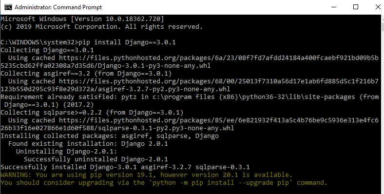
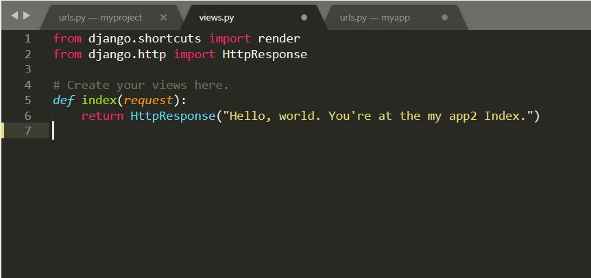

## Django - Documentation

* **Python web Frameworks :**
  * Django
  * Flask
  * web2py
  * Bottle
  * cherrypy
  * etc.....
### What is a web Framework?
 * A web framework or web application framework is a software framework that is designed to support the development of web applications including web services, web resources, and web APIs. Web frameworks provide a standard way to build and deploy web applications.

## Django Introduction :

### Why django Framework?
 * Django is a Python web framework
 * A Framework provides a structure and common methods to make the life of a web application developer much easier for building    flexible, scalable and maintainable web applications.

### What is Django ?

* A Python web framework is a code library that provide tools and libraties to simplify common web development operations.
* It is based on MVT (Model View Template) design pattern.
* Django is a high-level and has MVC,MVT styled Architecture.
* Django web framework is written on quick and powerful python language.
* Django has a open-source collection of libraries for building afully functioning web application.
* It takes less time to build application after collecting client requirement.

### Features of Django :

 * **very fast  :**
   * It works very fast.
 * **Fully Loaded  :**
   * Django includes various helping task modules and libraries which can be used to handle common Web development tasks. Django takes care of user authentication, content administration, site maps.
 * **Secure  :**
   * Its user authentication system provides a secure way to manage user accounts and passwords.
 * **Scalable  :**
   * Django is scalable in nature and has ability to quickly and flexibly switch from small to large scale application project.
* **OpenSource  :**
  * Django is versatile in nature which allows it to build applications for different-different domains.
  

### MVT Architecture of Django  :

* Every Web applications follows architectures
  * MVC (Model View Controller)
  * MVT (Model View Template)
  * etc..
* Django is a MVT pattern.
* MVC is slightly different from MVT as Django itself takes care of the Controller part.


* MVT is a software Design patern
* It is a collection of three important components Model View and Template.
* **Model  :**
  * The Model helps to handle database. It is a data access layer which handles the data.
* **Template  :**
  * The Template is a presentation layer which handles User Interface part completely.
* **View  :**
  * The View is used to execute the business logic and interact with a model to carry data and renders a template.


  
* Here, a user requests for a resource to the Django, Django works as a controller and check to the available resource in URL.If URL maps, a view is called that interact with model and template, it renders a template.Django responds back to the user and sends a template as a response.

## **Django Installation :**
  * **download python from website based on your system properties 64/32.** [Download Link](https://www.python.org/downloads/windows/)**
  	* Prefer to python version is 3.7.6
	* if we use below 3.4.3 version we need to give manual path for python and scripts,otherwise pip does'nt work.
  * **Download sublimetext or any other editor tools for editing purpose.**.[Download Link](https://www.sublimetext.com/3)
  * ceck wheather 'pip' is working or not in the 'cmd'
  
  
  
  * install django # # (latest Version 3.0) wait for installation
  * if you want perticular version then try `pip install Django==3.0.1"` or 
  * By Default version try `pip install django`
  
  
  
  * After installing to check the version of Django Framework.
    ```
       cmd>django-admin --version
                 (or)
       cmd>python
       >>>import django
       >>>django.get_version()    or    django.VERSION
          '1.11'                   (1,11,0, 'final',1)

	  
	  
## **Project Creation**
* Now, to create a Project in spcefied folder where to do and now open cmd in same path :
	```
			   path		                   creating project
	    D:\Shiva-Venkat\MyPractice>django-admin startproject myproject(projectname)
	    D:\Shiva-Venkat\MyPractice>cd myproject
	    D:\Shiva-Venkat\MyPractice\myproject
	    

	    
	    
	    
* Present we are in our Django Project(College) path.
* Check in browser wheather its working or not
  	```
	    D:\Satheesh\MyPractice\myproject>python manage.py runserver
	    localhost:8000/
	    it is localhost address --> http://127.0.0.1:8000/
	    it worked..!
	    

  
## **App Creation in Project**
* Create a new App in Project
	```
	D:\Shiva-Venkat\MyPractice\myproject>python manage.py startapp appname(myapp)
	D:\Shiva-Venkat\MyPractice\myproject>python manage.py runserver
	localhost:8000/
	it is localhost address --> http://127.0.0.1:8000/
	

		
## **urls.py :**
* we have defaultly urls.py in  our created project(myproject) but we dont have urls.py in our own app so we should create new file with name urls.py in our own App(myapp).
* Now we find the Students App in our project(College).
* Now goto myapp folder and create "urls.py" file and add like this

  	```
	from django.urls import path
	from myapp import views
	urlpatterns=[
		path('index/',views.index,name="index"),

	]

> _NOTE:_ here i am importing views from myapp and mentioned one path because,if we browse localhost:8000/myapp/index then it goes to views part index function and gives return template as a output. 

* goto (myapp/views.py file) myapp folder open views.py file and add like this.
	```
		
	from django.shortcuts import render
	from django.http import HttpResponse
	def index(request):
			return HttpResponse("<h2>Hello World</h2>")
* Create a function index in the views.py file. This function will be mapped from the myapp/urls.py file.

> **_NOTE:_** import HttpResponse from http package and defining the function index.

* goto (College/urls.py file) College folder open urls.py file and add like this.
	
* Django already has mentioned a URL here for the admin. The path function takes the first argument as a route of string or regex type.The view argument is a view function which is used to return a response (template) to the user.


	
		from django.contrib import admin
		from django.urls import path,include
		from appname(myapp) import views
		urlpatterns = [
	   		path('admin/', admin.site.urls),
			path('myapp/',include('myapp.urls'))
			]

* here we are importing the include because all the app urls are need to include in project urls.py file,so we are import include and giving path for browser.

* check in browser. localhost:8080/Students/index


	


* **You will get Hello World message**


### Url mappings
url mappings is done by two types
1. By Importing
2. By Using Include 
##### By Importing
Adding urls to urls.py file in project which is main urls file
by importing views from views.py file from app folder


for urls mapping in import format, we need to import all views from myapp(created app name) to the main url.py file
```python 
from app import views 
```
by doing this all the methods from views files will be imported to the main URLs file
and in URLs patterns, we need to add every method that we are going to use in views
by the name of path
``` python 
path('index/',views.index,name="index"),
```
form above  **'index/'**   is the url name and  in **views.index** index is the method name in views file in myapp **name: "index"** index is the name  in views file



we need to define a method for index when user type */index/* we need to return *Http response* for this we need to import HTTP response library
```pyhon
from Django.http import HttpResponse
```
and then as a response, this method will  return a Http response

``` python
	def index(request):
	return HttpResponse("Welcome to Django")
```
here  **index**  is the method name and **request** is Http request

#### By using Include
urls mapping is also done by using inculde we need to import include function with path
and we need to write a urls.py file inside the myapp 
```python
from django.urls import path,include
```


we can link up all the the urls from urls.py file inside the my app by using
```python
 path('myapp/',include('myapp.urls')),
 ```
Here **myapp** is the app name and we are using include which includes all *urls* from myapp.urls.
how many urls we define in ursl.py in my app will be mapped to main urls.py file 

##### urls.py file in myapp
we need to link up all the methods in views so that we need to import them in urls.py file and also the admin urls also
``` python
from django.urls import path
from myapp import views
```


then define paths 
``` python 
path('index/',views.index,name="index"),
```
form above  **'index/'**   is the url name and  in **views.index** index is the method name in views file in myapp **name: "index"** index is the name  in views file


we need to define a method for index when user type */index/* we need to return *Http response* for this we need to import HTTP response library
```pyhon
from Django.http import HttpResponse
```
and then as a response, this method will  return a Http response

``` python
	def index(request):
	return HttpResponse("Welcome to Django")
```
here  **index**  is the method name and **request** is Http request
